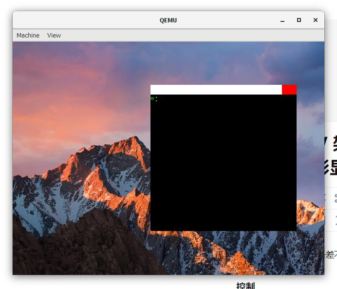

# 太素 TisuOS

**QQ交流群号：961871659**

太素OS是一个用 Rust 编写的基于 RISCV 架构的操作系统，主要用于教学目的，为初学者提供参考。

Tisu OS is a RISCV-based operating system written in Rust and designed primarily for educational purposes and as a reference for beginners.

gitee 地址：https://gitee.com/belowthetree/tisu-os （包含硬盘镜像，最新推送）

github 地址：https://github.com/belowthetree/TisuOS （纯源码版本，删除了镜像、target 文件夹）

## 编译

环境：

* wsl
* rust-nightly

`make build`

**根据热心群友 wjl 提醒，今后版本不使用 gcc 编译**

## 运行：

平台：QEMU

* qemu-system-riscv64

指令：`make run`

## 包含

* 基础教程部分，为 os-tutorial
* 扩展部分 tisuos，重构的代码

基础教程部分有一些 BUG，不过并不影响大部分情况下的运行，扩展重构部分修复了一些 BUG 并且优化了整个系统的结构。如果你想使用本系统的源码，推荐使用扩展部分，即 `tisuos/` 目录下的源码。

There are a few bugs in the tutorial section `os-tutorial/`, but they can work in most cases, and the extended section fixes some bugs and optimizes the overall structure of the system. If you want to use the source code of this system, it is recommended to use the extended section, which is the source code in the `tisuos/` directory.

## 教程部分

本项目提供教程，默认学习者具备基本的计算机知识，包括但不限于：

* 编译、链接
* 进程、线程的基本概念
* 内存的基本概念
* 一定的算法知识

其中涉及到的

* `Rust` 语言部分需要学习者自学（不难）
* 链接文件不需要掌握，看得懂会改就行
* `Makefile` 会查资料修改就行

大部分的章节都有对应的源码（除了部分内容较少的章节，一般在下一章节可以找到对应的源码）。后面章节不提供章节源码，可以在`os-tutorial` 文件夹中获取。为了减小体积，会删除 `target`、硬盘镜像，需要自己新建。

完整的内核最新版在 `gitee` 保持更新，会同步纯源码版（网速原因）到 `github` （当我想起来的时候）。

### 内核功能

| 功能     | 内容                                               | 状况                             |
| -------- | -------------------------------------------------- | -------------------------------- |
| 设备管理 | UART、块设备、GPU、键盘、鼠标                      | 已完成，但网络等其它设备待添加   |
| 中断处理 | 时钟中断、系统调用、错误处理                       | 完成基本功能                     |
| 内存管理 | 页表管理（最先适配方式）、堆内存管理（类SLAB算法） | 已完成                           |
| 任务系统 | 进程、线程、调度器                                 | 完成基本功能，其它调度方法待添加 |
| 文件系统 | 支持 FAT32 格式读取、写入                          | 完成基本功能，考虑添加其它格式   |
| 图形桌面 | 拥有类似 dock、窗口的功能                          | 只有基本浏览交互功能             |

## License

[GPL-v3](./LICENSE)

