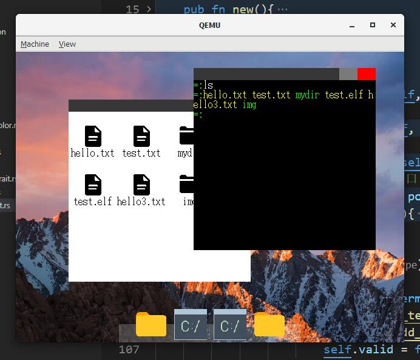

# 太素 TisuOS


**QQ交流群号：961871659**


太素OS是一个用 Rust 编写的基于 RISCV 架构的操作系统，主要用于教学目的，为初学者提供参考。

Tisu OS is a RISCV-based operating system written in Rust and designed primarily for educational purposes and as a reference for beginners.



gitee 地址：https://gitee.com/belowthetree/tisu-os （包含硬盘镜像，最新推送）

github 地址：https://github.com/belowthetree/TisuOS （纯源码版本，删除了镜像、target 文件夹）

## 编译

环境：

* wsl
* riscv64-unknown-linux-gnu-gcc
* rust-nightly

`make all`

**另外，根据热心群友 wjl 提醒，可以不使用 gcc 进行编译**：

将 `src/lib.rs` 改为 `src/main.rs`，去掉 Cargo.toml 中的 [lib] 属性，为 `src/main.rs` 中的 `feature` 添加 `global_asm` ，汇编文件以如下方式引用：

```rust
global_asm!(include_str!("asm/boot.S"));
global_asm!(include_str!("asm/mem.S"));
global_asm!(include_str!("asm/func.S"));
global_asm!(include_str!("asm/trap.S"));
```

使用 `cargo build` 即可编译，生成的可执行文件在 `target\riscv64gc-unknown-none-elf\debug` 中，与项目同名且无后缀

## 运行：

* QEMU-system-riscv64

`qemu-system-riscv64 -machine virt -cpu rv64 -smp 4 -m 512M -drive if=none,format=raw,file=hdd.dsk,id=foo -device virtio-blk-device,scsi=off,drive=foo -nographic -serial mon:stdio -bios none -device virtio-rng-device -device virtio-gpu-device -device virtio-net-device -device virtio-tablet-device -device virtio-keyboard-device -kernel `

## 包含

* 基础教程部分，为 os-tutorial
* 扩展部分 tisuos，重构的代码

基础教程部分有一些 BUG，不过并不影响大部分情况下的运行，扩展重构部分修复了一些 BUG 并且优化了整个系统的结构。如果你想使用本系统的源码，推荐使用扩展部分，即 `tisuos/` 目录下的源码。

There are a few bugs in the tutorial section `os-tutorial/`, but they can work in most cases, and the extended section fixes some bugs and optimizes the overall structure of the system. If you want to use the source code of this system, it is recommended to use the extended section, which is the source code in the `tisuos/` directory.

## 教程部分

### 说明

本项目提供教程，默认学习者具备基本的计算机知识，包括但不限于：

* 编译、链接
* 进程、线程的基本概念
* 内存的基本概念
* 一定的算法知识

其中涉及到的

* `Rust` 语言部分需要学习者自学（不难）
* 链接文件不需要掌握，看得懂会改就行
* `Makefile` 会查资料修改就行

大部分的章节都有对应的源码（除了部分内容较少的章节，一般在下一章节可以找到对应的源码）。后面章节不提供章节源码，可以在`os-tutorial` 文件夹中获取。为了减小体积，会删除 `target`、硬盘镜像，需要自己新建。

完整的内核最新版在 `gitee` 保持更新，会同步纯源码版（网速原因）到 `github` （当我想起来的时候）。

### 内核功能

#### Uart

通用异步收发传输器

命令行的输入可以通过 MMIO 获取，同时可以输出到命令行，作为主要的调试手段

####  中断

包括汇编、Rust 两部分，中断首先跳转到汇编部分，再转到 Rust 部分

汇编部分负责保存与恢复环境，中断负责具体的处理

####  内存管理

* 分页管理，将内存按照 4kb 大小的页表进行记录管理，前 1G 的地址属于 MMIO。128MB 内存，内核分到 80MB
* 分块堆内存管理，在分页管理的基础上，采用类似 SLAB 的方法，每次分配内存时将大小对齐到 2^n，将申请到的内存按照对应大小划分成许多块进行标记管理。

####  页表映射

在分页管理的基础上，管理三级的页表。仅在映射时进行内存申请。

####  PLIC

平台级中断控制

主要用于控制时钟中断和软件中断（待完成）

* 时钟中断，现设置为 15_0000 个周期（15ms）进行一次中断

####  同步

利用 RISCV 原子交换实现

* 单重锁，仅可以同时上锁一次
* 多重锁，同一个核心可以上锁多次（主要是给中断时的进程调度使用，可以在函数调用中多次上锁）
* 读写锁，支持读取时允许多次上锁，写入时只允许锁一次

####  任务

* 进程，分为用户、内核两种，作为程序存在的标志
  * 内存映射，默认映射执行地址的一个页表以及栈内存对应页表。同时为内核进程映射所有内核用地址以及用户地址，为用户进程映射内核系统调用地址
  * 进程代表程序，管理所属的所有线程
* 线程，作为进程的子集，通过 fork 产生，更加轻量，不需要再次进行内存映射
  * 每个线程分配16张页表作为栈
  * 调度，通过时钟中断触发调度，暂停当前内核标记为 Running 的进程、选取下一个标记为 Waiting 的进程标记为 Running 并运行
  * 第一个线程作为主线程，主线程结束所有线程被卸载，进程结束

####  外部设备

* 块设备，即磁盘。支持同步读写（用单重锁实现，操作发出后锁住，读写完成后触发中断解锁）、异步读写（创建一个 Sleeping 的进程，读写完成后触发中断唤醒待执行进程）
* GPU，图形化显示
* 输入设备，包括键盘、鼠标等的输入（nographic 选项下无效，因为需要 qemu 的窗口捕捉输入）

####  磁盘读写缓冲

预先读取大块磁盘中的内容放置在缓冲内存中。所有读写操作都写入缓冲部分内存。目前只实现了读取，写入待完成。

####  文件系统

目前实现了 FAT32 文件系统的读取。

文件系统以文件树的形式展示，可以读取运行 elf 程序

####  Shell（调试用）

一个简单的命令行交互程序，以独立进程运行，用于调试功能

####  图形接口

* element，基本显示单元，维护一个矩形作为显示内容，支持透明度
* canvas，在 element 的基础上支持翻页功能

####  桌面系统

一个简单的桌面系统，包含命令行窗口、文件夹窗口、Dock。支持一些简单的交互

## 重构部分

* 内存管理

  * 算法原理照旧
  * 拆分了管理结构：bitmap、memory
  * 添加大量 Result、Option
  * 简化了 `Memory` 用法
* Block 内存结构

  * 新增内存复制 API
  * 变为泛型
  * 将底层部分外内存部分替换为 Block，以此减少不安全代码
* 设备中断

  * 将设备中断处理独立挂载在线程中，避免造成内存部分死锁
* 同步

  * 新增同步结构：Bool，保证读取修改同步，用于设备中断
* 命令行交互

  * 修改 UART 输入 API
  * `Shell` 变为 `ConsoleShell`，全局唯一
* 文件系统

  * 修改中间层交互方式，更具扩展性
  * 文件树结构分为：`Directory`、`File`
  * 文件操作交由 `File` 完成
* 图形底层

  * 改为 ColorBlock 作为底层直接显示单元
  * 新增 Grid 作为网格显示，具有翻页功能
  * 

* 桌面系统
  * 上下层交互通过传递事件枚举实现
  * 窗口添加返回上层目录按钮
  * 文件窗口实现点击进入目录功能


## License

[GPL-v3](./LICENSE)

