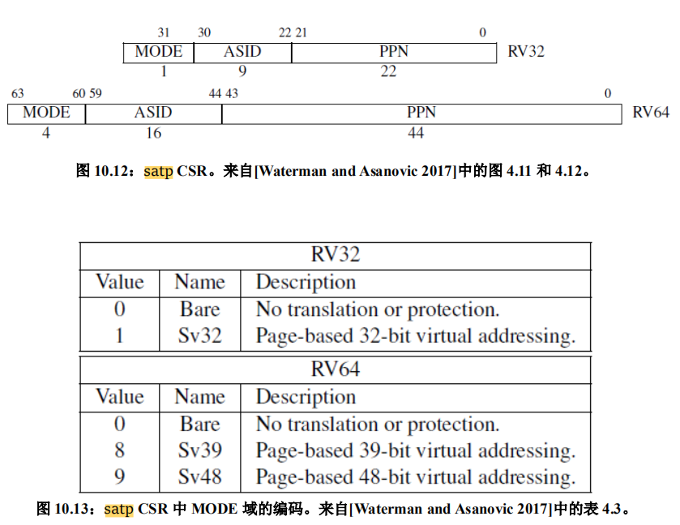
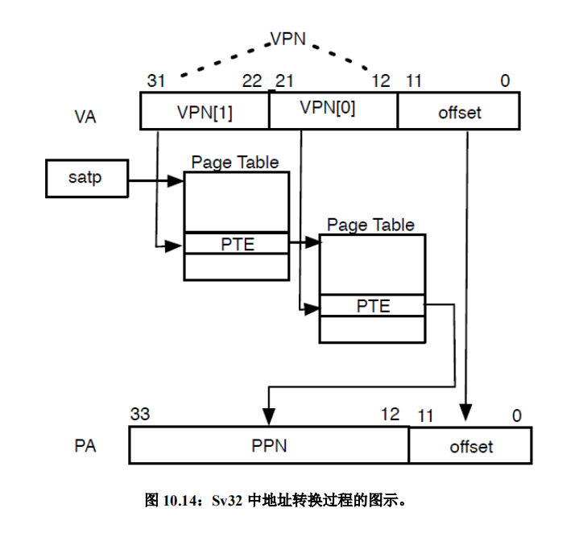
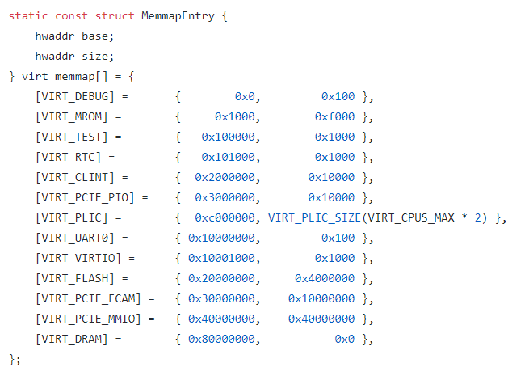
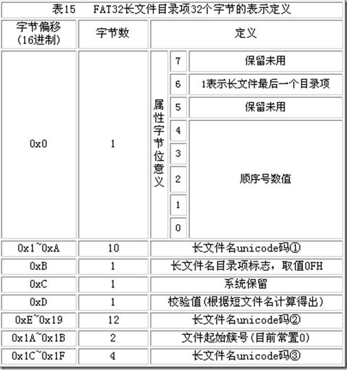

# 太素OS

[TOC]

## 说明

**注意！！！！！！教程中的章节代码并非最正确的，后期修复了许多 BUG，请以实际的内核源码为准**

**注意！！！！！！教程中的章节代码并非最正确的，后期修复了许多 BUG，请以实际的内核源码为准**

**注意！！！！！！教程中的章节代码并非最正确的，后期修复了许多 BUG，请以实际的内核源码为准**

太素 OS 是一个 RISCV 架构的 Rust 编写的系统内核（当然比较简陋，甚至只能在 QEMU 上运行）。本项目实现了

* 外部设备控制，包括：
  * 鼠标输入
  * 键盘
  * 块设备
  * GPU
* 中断管理
* 内存管理，以一种类似 Slab 的方式基于内存页进行管理
* 任务系统，包括：
  * 进程，作为程序存在的唯一标志
  * 线程，程序执行的具体单位
* 文件系统，对于 FAT32 的读写，不过比较简陋，主要用于测试 exec 调用
* 磁盘缓冲
* Shell，基于 UART 的简单调试用交互工具
* 图形接口，开发中

更多功能还在开发中，已有功能也不是特别完善，还需要继续开发

### 创作初衷

制作本项目主要还是出于对于编程、创造的热情。带学原计划是花半学期学习一下操作系统知识，没想到操作系统博大精深。一做就是一年。期间通过看书、参考已有实例以及重构原有项目的方式制作了三个版本（都是X86架构），但是都挺一般的，因为硬件知识的匮乏（国内教育的硬伤）。后来在学习 Rust 的时候发现了一些基于 RISCV 的操作系统，略加了解之后发现 RSICV 是一个非常优秀的架构。在这里我要吹一下 RISCV：

* 没有历史包裹，相比之下 x86 简直就是满清余孽，一堆繁杂的设定直接在进入内核前把新手给送走
* 统一使用内存映射（MMIO）加 VirtIO 的方式操控外部设备，非常方便（就是这资料找着费劲），x86 的话印象中是通过 IO 控制 MSR

另一方面，了解了 Rust 之后我自制编译器的想法就被干碎了。毕竟在 Rust 这么优秀的语言面前，感觉自己整活有点像杂耍。

所以决定用 Rust 在 RISCV 架构下做一个系统内核，算是弥补之前几个内核粗制滥造、不甚明晰的遗憾（同时作为毕设）。

而将本项目开源并提供完整教程则是出于程序员应有的（个人认为）开源、共享精神；也因为本人大部分知识技能都来源于热心网友的分享；也因为大部分学校这方面的教程基本是空白。希望后来者可以利用本教程跳过绝大部分坑，避免浪费不必要的时间、精力**很重要的一点是，制作一个内核的大部分时间其实是在查找相关资料上**，个人认为这毫无必要。这多出来的时间用来做什么不好呢？。

### 为什么是太素

太素是道家五太之一，可以演化万物（玄幻小说看多了吧）

### 项目参考

本项目参考了一些书籍和网上零零散散的一些资料、实例

* 学习之初参考了许多书籍：《30天自制操作系统》《Orange 一个操作系统的实现》《一个64位操作系统的设计与实现》，这些书籍的讲解替我打开了新世界的大门，并且影响了本项目的一个思路，在此感谢这些作者。
* 在构建项目初期主要参考了一位大学老师的项目 https://osblog.stephenmarz.com/ 好像是 UTK 的史蒂芬教授的一个上课用的教程（没有他的设备控制部分的代码我还不知道要查多久资料，顺便也借用了他项目中初期的一些代码）
* 自制操作系统，必然绕不开 Linux 系统，毕竟上面提到的几个教程基本都收到了 Linux 的影响，那么本项目也就自然而然参考了 Linux，本书中的一些概念也是受到了 Linux 系统的启发
* http://crva.ict.ac.cn/documents/RISC-V-Reader-Chinese-v2p1.pdf，这个是 RISCV 的手册，建议翻看一遍
* 还有许多零零散散的资料实在无法列出来

## 第一章-编译运行基本的代码

### 环境配置

> 参考：
>
> https://rcore-os.github.io/rCore-Tutorial-deploy/docs/pre-lab/env.html
>
> https://osblog.stephenmarz.com/
>
> https://gitee.com/yushulx/riscv-gnu

个人使用 Windows 子系统进行编译运行（这看起来比较异类），硬盘文件的拷贝使用 Linux 虚拟机进行（因为 wsl 好像无法挂载硬盘镜像，这在后面测试 exec 调用和文件系统的时候比较麻烦）。要编译出 RISCV 架构的文件需要编译一下对应的 gcc 。这里有一个热心网友分享了方法 https://gitee.com/yushulx/riscv-gnu-toolchain（编译时间非常长，需要好几个小时，做好准备）。编译完成后需要添加路径：

1. `vi ~/.bashrc`
2. 在文件的最后面加入`export PATH=$PATH:/opt/riscv/bin`（因为默认安装到了 /opt/riscv 文件夹下）
3. 输入 `source ~/.bashrc`
4. 尝试输入 riscv 然后按下 tab 键，如果有补全提示，说明成功。

接着就是 Rust 的安装：

`export RUSTUP_DIST_SERVER=https://mirrors.ustc.edu.cn/rust-static
export RUSTUP_UPDATE_ROOT=https://mirrors.ustc.edu.cn/rust-static/rustup
curl https://sh.rustup.rs -sSf | sh`

接着运行 `rustup target add riscv64gc-unknown-none-elf` 添加交叉编译的目标

最后是 QEMU 的安装，用来运行我们的系统 `sudo apt-get install qemu-system-misc`

我们会用到硬盘，可以使用命令：`dd if=/dev/zero of=hd.dsk bs=1M count=512` 来创建

### 创建并配置项目

#### 创建项目

使用 `cargo new tisuos --lib` 创建一个新的项目，它会自动创建一个文件夹并加入一些必要的文件

```
-tisuos
--src
----lib.rs
--Cargo.toml
```

我们在文件夹内新建一个名为 `rust-toolchain` 的文件，里面加入一行 `nightly-2020-01-27` 即可，对于 Rust 而言这个项目便会用 nightly 版本进行编译，因为有些必要的特性只能在 nightly 版本中使用。

#### 配置项目

新建一个 `.cargo` 文件夹，在里面创建一个 `config.toml` 文件，里面写入：

```rust
[build]
target = "riscv64gc-unknown-none-elf"
rustflags = ['-Clink-arg=-Tsrc/lds/virt.lds']

[target.riscv64gc-unknown-none-elf]
runner = "qemu-system-riscv64 -machine virt -cpu rv64 -d guest_errors,unimp -smp 4 -m 128M -drive if=none,format=raw,file=hdd.dsk,id=foo -device virtio-blk-device,scsi=off,drive=foo -serial mon:stdio -bios none -device virtio-rng-device -device virtio-gpu-device -device virtio-net-device -device virtio-tablet-device -device virtio-keyboard-device -kernel "
```

在 `src/` 文件夹下创建一个 `lds` 文件夹，创建一个 `virt.lds` 文件，内容如下：

```
OUTPUT_ARCH( "riscv" )

ENTRY( _start )

MEMORY
{
  ram   (wxa) : ORIGIN = 0x80000000, LENGTH = 128M
}

PHDRS
{
  text PT_LOAD;
  data PT_LOAD;
  bss PT_LOAD;
}

SECTIONS
{
  .text : {
    PROVIDE(_text_start = .);
	
    *(.text.init) *(.text .text.*)

    PROVIDE(_text_end = .);
	
  } >ram AT>ram :text
   
   PROVIDE(_global_pointer = .);
   
  .rodata : {
    PROVIDE(_rodata_start = .);
    *(.rodata .rodata.*)
    PROVIDE(_rodata_end = .);
	
  } >ram AT>ram :text

  .data : {
	
    . = ALIGN(4096);
    PROVIDE(_data_start = .);
	
    *(.sdata .sdata.*) *(.data .data.*)
    PROVIDE(_data_end = .);
  } >ram AT>ram :data

  .bss : {
    PROVIDE(_bss_start = .);
    *(.sbss .sbss.*) *(.bss .bss.*)
    PROVIDE(_bss_end = .);
  } >ram AT>ram :bss

  PROVIDE(_memory_start = ORIGIN(ram));
  
  PROVIDE(_stack_start = _bss_end);
  PROVIDE(_stack_end = _stack_start + 0x80000);
  PROVIDE(_trap_stack_start = _stack_end);
  PROVIDE(_trap_stack_end = _trap_stack_start + 0x40000);
  PROVIDE(_memory_end = ORIGIN(ram) + LENGTH(ram));

  PROVIDE(_heap_start = _trap_stack_end);
  PROVIDE(_heap_size = _memory_end - _heap_start);
}
```

链接文件没怎么接触过，所以这段我抄别人的，然后改了改。链接文件就是指挥你的编译器如何链接、分配文件位置的。

* 里面可以看到有 `.text` 这样的用法，意味着代码段会被放在这。比如：

```
.text : {*(.text.init)}
.data : {PROVIDE(_data_end = .)}
```

意味着 `.text.init` 标记的内容会当做代码段，紧接着是数据段，其中会发现有个 `PROVIDE`，这其实就是告诉编译器，代码中名字为 `_data_end` 的变量，它的值等于这个地址，`.` 代表的是当前位置

* `ALIGN` 就是对齐的意思
* 同时可以注意到有一句：`ram   (wxa) : ORIGIN = 0x80000000, LENGTH = 128M`。这句的意思是说我们的地址从 16 进制 0x80000000 开始，这是 `RISCV` 的内存映射导致的，我们的前面 1G 的地址用于内存映射，所以我们的内核会被 QEMU 加载到 0x80000000 处开始放置

最后打开 `Cargo.toml` 加入：

```
[lib]
crate-type = ["staticlib"]
```

#### 编译命令

接下来我们需要一个 `Makefile`  用来快速执行我们的编译命令，这里借鉴前面提到的教程里的

```makefile
#####
## BUILD
#####
CC=riscv64-unknown-linux-gnu-gcc
CFLAGS=-Wall -Wextra -pedantic -Wextra -O0 -g
CFLAGS+=-static -ffreestanding -nostdlib -fno-rtti -fno-exceptions
CFLAGS+=-march=rv64gc -mabi=lp64
INCLUDES=
LINKER_SCRIPT=-Tsrc/lds/virt.lds
TYPE=debug
RUST_TARGET=./target/riscv64gc-unknown-none-elf/$(TYPE)
LIBS=-L$(RUST_TARGET)
SOURCES_ASM=$(wildcard src/asm/*.S)
LIB=-l tisuos -lgcc
OUT=os.elf

#####
## QEMU
#####
QEMU=qemu-system-riscv64
MACH=virt
CPU=rv64
CPUS=4
MEM=128M
DISK=hd.dsk
DRIVE= -device virtio-gpu-device -device virtio-net-device -device virtio-tablet-device -device virtio-keyboard-device -drive if=none,format=raw,file=$(DISK),id=foo -device virtio-blk-device,scsi=off,drive=foo


all:
	cargo build
	$(CC) $(CFLAGS) $(LINKER_SCRIPT) $(INCLUDES) -o $(OUT) $(SOURCES_ASM) $(LIBS) $(LIB)
	
run: all
	$(QEMU) -machine $(MACH) -cpu $(CPU) -smp $(CPUS) -m $(MEM) $(DRIVE) -nographic -serial mon:stdio -bios none -kernel $(OUT)


.PHONY: clean
clean:
	cargo clean
	rm -f $(OUT)
```

这里我们只需要 128M 的内存

#### 基本代码

打开 `lib.rs` 文件，我们将内容改为：

```rust
#![no_std]

#[panic_handler]
fn panic(_info :& PanicInfo) -> ! {
    if let Some(p) = _info.location() {
	}
    else {
    }
    abort();
}

#[no_mangle]
extern "C" fn abort() -> !{
    loop{
    }
}

use core::panic::PanicInfo;


```

* 首先我们设置 `#![no_std]` 意味着不使用标准库，因为标准库需要依赖现有的系统，井号是 `rust` 用来设置属性的，加上感叹号是全局属性
* 接着是 `panic_handler` ，在 `rust` 中会有一些运行时的安全性检查，比如加减法溢出等，会出发 `panic`，因为没有了标准库，所以需要我们手动定义一个`panic` 函数
* `no_mangle` 属性作用在一个函数上面可以禁止 `rust` 在编译的时候对名字进行加工，即在目标代码中使用函数的原名

#### 运行

接下来进入 `tisuos` 目录，输入`make run` 可以运行，但是因为我们什么也没做，所以不会有任何输出。按下 `ctrl + A` 之后按下 `X` 可以退出 QEMU

## 第二章-用汇编设置处理器环境

> 参考：
>
> https://osblog.stephenmarz.com/
>
> http://crva.ict.ac.cn/documents/RISC-V-Reader-Chinese-v2p1.pdf （中断部分）

###  知识预备

> 可以查阅 RISC-V-Reader 第十章

#### 特权级

现代的处理器一般都有特权级，大部分系统会设置三个等级：用户、内核、机器。RISCV 机器模式（机器级）的特权级记录在 `mstatus` 的 `MPP` 位中，0 是用户、1 是内核、2 保留、3 是机器，高等级的特权可以执行一些低等级无法执行的操作，如：机器模式可以操控 `m` 系列状态控制寄存器（`mstatus` 等）。

#### 状态控制寄存器

机器模式（机器级）下，指 `mstatus`、`mpie` 。。。。。等寄存器

用 `csrr` 读取

用 `csrw` 写入

#### 中断

中断发生之后，处理器会停止执行当前的命令，然后去执行预先设置好的指令

1. 中断分为两种

* 一种是设备或者代码调用触发的，也叫中断，通常是为了通知处理器处理一些事件。比如：
  * 鼠标移动、键盘按下会触发中断，处理器就会转过去处理输入信息
* 另一种是出现了错误，处理器自动触发中断，又叫同步异常，比如：
  * 页表错误，处理器访问了没有映射的地址
  * 除零错误

2. 中断号保存在 `mcause` 寄存器中，记录了中断类型。最高位是 1 说明是同步异常，否则是中断
3. `mepc` 储存中断前执行指令的地址，调用 `mret` 返回后会执行其中的地址
4. 对于 `RISCV` 而言，当前运行的状态保存在`mstatus` 寄存器中

* `MPP` 位记录当前机器模式的特权等级，0 是用户级，1 是内核级，2 保留，3 是机器级，权限最高
* `MPIE` 记录触发中断前的`MIE` 位的值，`MIE` （Machine Interrupt Enable）位为 1 的时候，中断才会触发

`RISCV` 不支持中断嵌套，即中断触发之后会将 `mstatus` 的 `mie` 位置 0

中断处理的第一条指令地址存储在 `mtvec` 中，`mie` 寄存器（不是`mstatus` 寄存器中的`mie`位）控制哪些中断可以被触发，只有对应位置置一的中断号的中断会触发。

中断处理完成之后需要返回，从机器模式的中断返回需要调用 `mret` 指令，它会 **将 PC 设置为 mepc，通过将 mstatus 的 MPIE 域复制到MIE 来恢复之前的中断使能设置，并将权限模式设置为 mstatus 的 MPP 域中的值**。


### 编写一个 BOOT

> 因为源码太长，只列出一部分源码，全部源码参考项目对应章节

在 `src/` 创建一个 `asm/` 文件夹，创建一个 `boot.S` 文件

```assembly
	# 让其它（非0号）硬件线程挂起，跳转至 3
	csrr	t0, mhartid
	bnez	t0, 3f
	csrw	satp, zero
```

这里是读取处理器的核心号码（mhartid），我们只需要使用 0 号核心进行初始化操作，非 0 的核心会跳转到后面挂起

```assembly
	# 先初始化
	li		t0, (0b11 << 13) | (0b11 << 11) | (1 << 7)
	csrw	mstatus, t0
	la		t1, kernel_init
	csrw	mepc, t1
	la		t2, m_trap_vector
	csrw	mtvec, t2
	li		t3, 0xaaa
	csrw	mie, t3
	la		ra, 4f
	mret
```

这里出现一个关键的指令 `csrw` 意思是写入状态控制寄存器。每个核心都有一系列状态控制寄存器，可以参考 RISCV 手册。下方列出的是 `mstatus` 状态寄存器的每个位的情况。

* 使 `FS` 置位，可以开启浮点运算（不开启的话使用浮点数会报错）
* 使 `MPIE` 置位，手册里的说法是，这个位储存中断前 `MIE` 的值，当我们从中断返回后 `MPIE` 会放到 `MIE` 中
* 使 `MPP` 置 `0b11`， `MMP` 标志着当前的特权级别，
* `mepc` 放置 `m_trap_vector` 函数的地址，出发中断后会跳转到 `m_trap_vector` （放在 `src/asm/trap.S` 中）
* 调用 `mret` 之后，会执行 `mepc` 中的地址，即 `kernel_init` 函数

### Rust 初始化函数

```rust
#[no_mangle]
extern "C" fn kernel_init(){

}

#[no_mangle]
extern "C" fn kernel_start(){

}
```

`no_mangle` 属性控制编译器使用原名，`extern "C"` 即 C 语言规范接口（万物基于 C 语言），按照 C  的规范编译链接

接着就可以运行了，如果没有报错，说明没问题

## 第三章-命令行输出

> 参考：
>
> https://osblog.stephenmarz.com/

之前的工作都是比较枯燥没什么激动人心的东西，接下来我们要使用 `UART` 进行输出


QEMU 模拟了 ns16550a 芯片，通过内存映射将对应的基地址映射到了 `0x1000_0000` 处，上图是每个偏移和每个位的说明。设置完后我们就可以通过键盘跟外部的命令行进行交互

```rust
let ptr = UART_ADDR as *mut u8;
// 偏移 3 指出每次传输的位数，恒定 8 位即一字节
ptr.add(3).write_volatile(8);
// 激活 FIFI
ptr.add(2).write_volatile(1);
// 激活中断
ptr.add(1).write_volatile(1);
// 设置输入产生的中断频率
let divisor : u16 = 592;
let divisor_least: u8 = (divisor & 0xff).try_into().unwrap();
let divisor_most:  u8 = (divisor >> 8).try_into().unwrap();
let lcr = ptr.add(3).read_volatile();
ptr.add(3).write_volatile(lcr | 1 << 7);

ptr.add(0).write_volatile(divisor_least);
ptr.add(1).write_volatile(divisor_most);
ptr.add(3).write_volatile(lcr);
```

1. 设置传输的位数，每次传输 8 位，即一个 ASCII 码的大小

2. 激活先进先出队列

3. 激活中断，这意味着我们的输入可以通过中断进行通知

4. 参考文章里的说法是 QEMU 的频率是 22.729 MHz，信号速率是 2400，具体什么意思不太清楚，不过我估计是设置中断的频率

   1. ```
      divisor = ceil( (clock_hz) / (baud_sps x 16) )
      So, we substitute our values and get:
      divisor = ceil( 22_729_000 / (2400 x 16) )
      divisor = ceil( 22_729_000 / 38_400 )
      divisor = ceil( 591.901 ) = 592
      ```

```rust
pub struct Uart;
/// 继承 Write Trait 使得 print 宏得以使用
/// 字符转换等由 Rust 提供，非常方便
impl Write for Uart {
	fn write_str(&mut self, out: &str) -> Result<(), Error> {
		for c in out.bytes() {
			self.put(c);
		}
		Ok(())
	}
}
impl Uart {
    /// ## 获取键盘输入
    /// 从 MMIO 对应地址获取输入
    pub fn get(&self) -> Option<u8> {
        unsafe {
            let ptr = UART_ADDR as *mut u8;
            if ptr.add(LSR_OFFSET).read_volatile() & 1 == 0 {
                None
            }
            else {
                Some(ptr.read_volatile())
            }
        }
    }
    /// ## 输出
    /// 通过 MMIO 的方式
    pub fn put(&mut self, c : u8) {
        unsafe {
            let ptr = UART_ADDR as *mut u8;
            ptr.add(0).write_volatile(c);
        }
    }
}
```

* 实现 Write 的 `trait` 使得我们可以用 uart 实现 `Rust` 自带的 print
* 输入输出直接读取、写入对应的地址即可，这就是内存映射，看起来是写入了内存，其实是和设备进行交互

```rust
#[no_mangle]
extern "C" fn kernel_init(){
    Uart::new().init();
    println!("hello kernel");
}
```

运行之后可以看到输出

## 关于错误及调试

### 输入输出调试

uart 输入输出作为主要的调试手段非常重要。开发内核调试手段非常单一，除 uart 之外你只能使用 gdb 来调试，但是不太方便，通常还是依赖输入输出来定位出错位置

### 常见错误

你可能会遇到非常多的错误，根据经验，如果你遇到的错误是调用了某些函数出现的，或者说这个错误很奇怪，莫名其妙，那么通常是栈的问题，某些函数栈指针越界修改了内存中的某些变量（通常这也是攻击手段）。要避免这种情况，首先确保你分配了足够大的栈给函数，本项目代码分配了很大的栈，理论上不会出问题，除非函数调用实在太深。

事实上，操作系统的绝大部分错误都是内存相关的

## 第四章-中断控制

> 参考：
>
> 同前

### 知识预备

前文已经提到中断触发之后处理器会停下手里的活，去执行别的地方的指令来处理中断，处理完中断后再返回。这个过程会破坏原有的寄存器环境，所以在我们跳转到 `m_trap_vector` 函数之后我们不能立刻进行处理，我们需要先进行环境的保存，在处理完中断后还要恢复环境，然后才能继续执行触发中断前的指令。

### 保存环境

`src/interrupt/trap.rs`

```rust
pub struct Environment{
    pub regs    :     [usize;32], // 0 ~ 255
    fregs       :     [usize;32], // 256 ~ 511
    pub satp    :     usize,      // 512
    pub epc     :     usize,      // 520
}
pub static mut ENVS : [Environment;4] = [Environment::new();4];
pub fn init(){
    unsafe {
        let ad = (&mut ENVS[cpu::get_hartid()] as *mut Environment) as usize;
        cpu::write_scratch(ad);
    }
}
```

这里定义一个结构体 `Environment` 用来代表处理器环境。同时定义一个静态变量数组 `ENVS` 用来作为临时储存的地方。具体的储存操作在汇编代码部分进行，保存完环境之后跳转到 Rust 部分，Rust 部分结束后回到汇编部分恢复环境，然后离开中断处理。可以看到我们根据当前的核心号修改了 `mscratch` 的值，这个寄存器一般是空闲的，我们可以用来存放数组其中一个元素的地址，这样在保存环境的时候直接把环境存入其中就可以了。

```assembly
# 读取 mscratch 的值放入 t6 中
csrrw	t6, mscratch, t6
# 利用宏进行批量操作，将所有寄存器的值保存
.set 	i, 1
.rept	30
save_gp	%i
.set	i, i+1
.endr

.set 	i, 0
.rept	32
save_fp	%i
.set	i, i+1
.endr

mv		t5, t6
csrr	t6, mscratch
save_gp 31, t5

csrw	mscratch, t5
csrr	t0, mepc
sd		t0, 520(t5)
csrr	t1, satp
sd		t1, 512(t5)

# Get ready to go into Rust (trap.rs)
# We don't want to write into the user's stack or whomever
# messed with us here.
mv		a0, t5
csrr	a1, mcause
csrr	a2, mhartid
csrr	a3, mstatus
mv		a4, sp
# 这里为中断处理程序开辟新的栈区，避免 Rust 部分栈增长过大影响执行
la		t0, _trap_stack_end
li		t1, 0x10000
mul		t1, t1, a2
sub		sp, t0, t1
# m_trap 是 Rust 中断处理函数
call	m_trap

csrw	mepc, a0

# Now load the trap frame back into t6
csrr	t6, mscratch

.set	i, 0
.rept	32
load_fp %i
.set i, i+1
.endr
# Restore all GP registers
.set	i, 1
.rept	31
load_gp %i
.set	i, i+1
.endr

mret
```

这里使用了汇编的一些宏（不然就要几十行重复的代码）。

为了测试中断功能，你可以故意在代码中触发一些错误，比如：

```rust
unsafe {
    let ptr = 0 as *mut u8;
    ptr.write_volatile(0);
}
```

不过要确保你在 `mie` 寄存器中开启了对应的中断

## 第五章-内存管理

> 接下来是本教程的重中之重，做不好接下来所有工作都无法正常进行

内存管理主要是做两个活：

* 记录内存使用情况
* 根据需求进行内存分配、释放

因为现代处理器基本都用页表进行内存管理，所以一般的做法是将内存划分成很多个页并记录他们的使用情况，这在后续的页表映射中会很方便。分配和释放的话也是基于分页，主要是根据申请的大小进行。

所以第一步是将内存按页进行划分。内存页分成两个部分，内核和用户，本项目大概给内核 八十多MB 的内存

### 将内存以页进行划分

我们在链接文件中定义好了一个 `_heap_start`，它在我们的中断用的栈后面。为了获取这个值，我们在 `src/asm/mem.S` 中获取了它

```
PROVIDE(_stack_start = _bss_end);
PROVIDE(_stack_end = _stack_start + 0x80000);
PROVIDE(_trap_stack_start = _stack_end);
PROVIDE(_trap_stack_end = _trap_stack_start + 0x40000);
PROVIDE(_heap_start = _trap_stack_end);
```

然后在 Rust 中用 `extern "C"` 得到它

```rust
extern "C" {
    // .....
	pub static HEAP_START: usize; // 内核占用内存结束地址，也是我们可自由分配地址的开始
    pub static HEAP_SIZE: usize;
    pub static MEMORY_START: usize; // 内核开始的地址
    pub static MEMORY_END: usize; // 内存结束地址
}
```

这里使用一个八位的页结构 `Page` 来代表一个内存页的使用情况。

`Page` 的工作逻辑是，申请内存页之后在 `Page` 数组里查找足够数量的内存页，然后将它们标记为已用，最后一个分页标记为 `End`。释放的时候根据地址，看看属于哪个内存页，然后逐个清空，直到遇到最后一个属性为 `End` 的 `Page`。

```rust
pub enum PageBit{
	Empty = 1 << 0,
	Taken = 1 << 1,
	End = 1 << 2,
	User = 1 << 3,
	Kernel = 1 <<4,
	Write = 1 << 5,
	Read = 1 << 6,
	Reserved = 1 << 7,
}

pub struct Page{
	pub flag : u8
}
```

我们直接在 `HEAP_START` 处开始，每一个字节存放一个 `Page`。一个 `Page` 代表一个 4KB 大小的内存页，这也是许多教程会采用的方式，直接在内核后面放置内存页的记录结构。

```rust
pub fn init(){
	unsafe {
        // HEAP_START 是内核结束的地址，我们把
		PAGES = HEAP_START as *mut Page;
        // 内存（包括 MMIO 区域）可以划分成多少个内存页
		TOTAL_PAGE = MEMORY_END / PAGE_SIZE;
		let ptr = PAGES;
		for i in 0..TOTAL_PAGE {
			(*ptr.add(i)).free();
		}
		
		let num_reserved = (TOTAL_PAGE * size_of::<Page>() + HEAP_START + PAGE_SIZE - 1) / PAGE_SIZE;
		for i in 0..num_reserved {
			(*ptr.add(i)).reserved();
		}
        // ...
	}
}
```

内存页的申请和释放非常简单，不过在返回申请结果前我们通常需要清零

```rust
pub fn alloc_kernel_page(num : usize) -> *mut u8{
	assert!(num > 0);
	unsafe {
		let ptr = KERNEL_PAGE_STRUCT_START;
		let mut cnt = 0;
		for i in 0..KERNEL_PAGE_NUM {
			if (*ptr.add(i)).is_free() {
				cnt += 1;
			}
			else {
				cnt = 0;
			}
			if cnt >= num {
				for idx in i + 1 - cnt..=i {
					(*ptr.add(idx)).take();
					(*ptr.add(idx)).set_kernel_read_write();
				}
				(*ptr.add(i)).end();
				let addr = ((i + 1 - cnt) * PAGE_SIZE + KERNEL_HEAP_START) as *mut u8;
				clear_page(addr, num);
				//println!("give {:x}", addr as usize);
				return addr;
			}
		}
		null_mut()
	}
}
/// 释放给定地址对应的内存页
pub fn free_page(addr : *mut u8) {
	assert!(!addr.is_null());
	unsafe {
		let n = (addr as usize) / PAGE_SIZE;
		if n <= NUM_RESERVE {
			return;
		}
		let ptr = KERNEL_PAGE_STRUCT_START as *mut Page;
		let mut idx = n - NUM_RESERVE;
		while !(*ptr.add(idx)).is_end() {
			(*ptr.add(idx)).free();
			idx += 1;
		}
		(*ptr.add(idx)).free();
	}
}
```

### 内存分配器

> 这部分的代码量比较多，不过我加了很多源码注释，理解了大致做法基本都可以看懂

#### 基本结构功能

内存分配器的主要作用是管理指定大小的内存，这里我参考了一些已有的例子（应该是 Slab 算法）。这种算法的思路是将申请的大小按照 2 的幂次向上对齐，然后一次申请一片内存，将内存按照对齐后的大小分块，每次申请同样的大小时就直接划出一块。为了加速计算且节约内存，用 `bitmap` 记录分块的使用情况，即用一位代表一个块。

```rust
pub struct Memory{
    physic_base : *mut u8,
    total_cnt : usize,
    free_cnt : usize,
    use_cnt : usize, // 统计非结构体自身占用块的数量
    size : usize,
    next : *mut Memory,
    bitlen : usize,
    search_idx : usize,
    bitmap : *mut u8,
    page : Page,
}
```

`Memory` 结构记录一片内存，然后将内存分块，按照块的大小从小到大排列

* `size` 记录了块的大小，按照 2 的幂次对齐
* `bitmap` 记录使用情况，一个位代表一个块，置 1 表示已用
* `page` 代表管理的内存的属性
* `search_idx` 是用来加速搜索空块的

内核与用户内存分别用两个空的 `Memory` 作为首元素

创建新的元素时按照如下逻辑：

1. 将大小按照 2 的幂次对齐

2. 如果比较小，申请四倍以上的空间，将 `Memory` 结构放在内存页的开头部分。

   1. ```rust
      // 确定对齐大小
      let sz = align(size);
      let num_alloc;
      // 确定分配页数
      num_alloc = Memory::decide_page_num(sz);
      let total_size = num_alloc * page::PAGE_SIZE;
      let struct_size = total_size / sz + size_of::<Self>();
      let phy_addr ;
      if (*h).page.is_kernel(){
          phy_addr = page::alloc_kernel_page(num_alloc);
      }
      else{
          phy_addr = page::alloc_user_page(num_alloc);
      }
      // 块的粒度较大时另外存放结构体
      if sz >= MEMORY_BLOCK_A_LITTLE_BIG {
          if (*h).page.is_kernel(){
              struct_addr = alloc_kernel(struct_size);
          }
          else {
              struct_addr = alloc_user(struct_size);
          }
          free_cnt = total_size / sz;
      }
      // 如果较小，则直接放置在申请的分页内
      else {
          struct_addr = phy_addr;
          free_cnt = (total_size - struct_size) / sz;
      }
      ```

3. 接着拼接到链表中

当一个分配请求发生时，进行如下操作：

1. 将大小按照 2 的幂次对齐
2. 查找符合大小且还有空余块的链表元素
3. 没有符合条件的就创建新的 `Memory`，有则直接下一步
4. 利用 `bitmap` 查找空闲的内存块

当内存释放时，并非直接释放：

1. 首先找到包含这块地址的链表元素

2. 释放对应的 `bitmap` 位点

   1. ```rust
      let mut head = (*h).next;
                  while !head.is_null() && !(*head).is_contain(addr){
                      head = (*head).next;
                  }
                  
                  assert!(!head.is_null());
      
                  (*head).free_bitmap(addr);
      ```

3. 如果此 `Memory` 内存块全部都是空闲状态，就要考虑是否把这个的 `Memory` 删除。这里的策略是如果相同大小的 `Memory` 中空闲的 `Memory` 数量大于三分之一，那么就释放这个 `Memory`

   1. ```rust
      let node = &*head;
      // 如果空块太多，释放掉此块
      if node.use_cnt == 0{
          let size = node.size;
          let free_cnt = Memory::get_free_block_num(size, h);
          if free_cnt > 1 && free_cnt * 2 > Memory::get_used_block_num(size, h) {
              // 如果块结构体在自己管理的分页内
              if node.free_cnt < node.total_cnt {
                  page::free_page(head as *mut u8);
              }
              else {
                  page::free_page(node.physic_base);
                  Memory::free(head as *mut u8, h);
              }
              Memory::delete(head);
          }
      }
      ```

#### Rust 容器

Rust 的一个好处是自带容器，只要你实现了它的构造、析构 `trait`。之后就可以使用 `Vec`、`Box` 等自带的容器、智能指针

```rust
struct OSGlobalAlloc;
unsafe impl GlobalAlloc for OSGlobalAlloc {
    unsafe fn alloc(&self, layout : Layout) -> *mut u8{
        alloc_kernel(layout.size())
    }

    unsafe fn dealloc(&self, ptr: *mut u8, _layout: Layout) {
        free_kernel(ptr);
    }
}
```

#### 总结

虽然此部分代码量很大，但是其实并不复杂。但是为了不出错，需要进行很多测试，因为后续的大量工作都依赖于内存管理。我写了一个测试用的函数在 `src/lib.rs` 中，如果你自己实现了自己的内存分配方法，一定要进行大量测试，合理使用 `assert!`，保证每个地方都按照预想输出。

当然，内存分配的方法并非唯一，可以参考我给出的那个史蒂芬教授的做法，直接一个链表把所有内存接起来也可以

### 页表映射

> RISC-V 手册10.6

#### 知识预备

物理地址指的是内存的实际地址；逻辑地址/虚拟地址指的是代码中的地址。如果没有开启分页，那么这两者一般等价。

然后是两个概念：

* 页表项，如下图。其中 `PPN` 储存物理页号，如果最后一级页表的页表项，则指向最终地址的页号，否则指向下一个页表的页号
* 页表，一个页表项数组，一般占据一个内存页的大小

分页功能开启后，当我们访问一个地址，处理器会首先找到根页表的位置，然后根据地址得到一个页表项。根据页表项中的地址访问物理内存或者找到下一个页表：

当我们访问某个地址的时候，处理器会将这个地址（称为逻辑地址）拆分成多段，比如三级页表，会分成四段。第一段在一级页表里面作为偏移读取对应的地址，读取的这个地址指向二级页表；第二段在二级页表里面作为偏移读取对应的地址，读取的这个地址指向三级页表；第三段类似，不过读取得到的地址是物理地址的一部分，然后逻辑地址的第四段加上这部分组成最终的地址指向物理内存。



对于 RISCV 而言，第一级页表的地址放在 `satp` 寄存器的 `PPN` 域中，当然这个地址被截断了，因为页表项总是占一个页表，所以它是以页表为单位，如果你的根页表放在 0x1000，那么它的 `PPN` 就是 1. 具体的映射可以看下图，VPN 就是逻辑地址（虚拟地址），这个是 32 位下的两级页表映射过程。



通常 64 位使用 Rv39，在逻辑地址中

* 39~30 位是第一级页表的偏移
* 21~29 位是第二级页表偏移
* 12~20 位是第三级页表偏移
* 0~11 位是地址页内偏移，需要和第三级的 `PPN` 拼起来组成物理地址

#### 实现

```rust
pub enum PageBit{
    Valid   = 1 << 0,
    Read    = 1 << 1,
    Write   = 1 << 2,
    Excute  = 1 << 3,
    User    = 1 << 4,
    Global  = 1 << 5,
    Access  = 1 << 6,
    Dirty   = 1 << 7,
}
pub struct PTE{
    flag : u64
}
pub struct PageTable{
    entry : [PTE; 512],
}
// ....
pub fn map(&mut self, virtual_addr : usize, physic_addr : usize, flag : u64){
    let vpn = [
        (virtual_addr >> 30) & 0x1ff,
        (virtual_addr >> 21) & 0x1ff,
        (virtual_addr >> 12) & 0x1ff
    ];
    let pte_first = &mut self.entry[vpn[0]];
    if !pte_first.is_valid() {
        let addr = page::alloc_kernel_page(1);
        assert!(!addr.is_null());
        pte_first.set_node_ppn(addr as u64);
        pte_first.set_flag(flag & 
            !PageBit::Read.val() & !PageBit::Write.val() & !PageBit::Excute.val());
        pte_first.set_valid();
    }
    let table_mid = unsafe {&mut *(pte_first.get_ppn() as *mut Self)};
    let pte_mid = &mut table_mid.entry[vpn[1]];

    if !pte_mid.is_valid() {
        let addr = page::alloc_kernel_page(1);
        assert!(!addr.is_null());
        pte_mid.set_node_ppn(addr as u64);
        pte_mid.set_flag(flag &
            !PageBit::Read.val() & !PageBit::Write.val() & !PageBit::Excute.val());
        pte_mid.set_valid();
    }
    let table_final = unsafe {&mut *(pte_mid.get_ppn() as *mut Self)};
    let pte_final = &mut table_final.entry[vpn[2]];
    pte_final.flag = 0;
    pte_final.set_leaf_ppn(physic_addr as u64);
    pte_final.set_flag(flag);
    pte_final.set_valid();
}
```

上述代码就是重复三次映射的过程，向内存管理器申请内存放置页表项

## 第六章-同步

同步其实是针对进程的。解决这样的一个情况：当进程一对一个全局变量进行修改的时候刚切换到了下一个进程，下一个进程又对这个全局变量进行了修改。假如这个变量是个指针，原本进程一想用它修改地址 0x100，结果进程二把它改成了 0x200，那么最终进程一就会修改 0x200 处的内容。

进程同步的原则就是让进程读取、修改某些变量时其它进程暂时无法访问，相当于下边的逻辑

```rust
let lock = false;
let a = 0;
while lock {}
lock = true;
a = 1;
lock = false;
```

当然，上边的代码只是举个例子，这个代码无法真正实现同步，因为无法保证在修改 `lock` 前其它进程不会读取 `lock` 

这里就要使用汇编中的原子操作了。**原子表示内存读写之间的过程不会被打断，内存值也不会被其它处理器核心修改**。

这里同样借鉴史蒂芬老哥的，不过在这个的基础上我扩展了一下

```rust
pub enum MutexState{
    Unlock = 0,
    Lock = 1,
}
/// ## 多重锁
/// 多重锁，允许一个核心多次上锁，这是为了解决单重锁在多重函数中反复上锁的需求
pub struct MultiMutex {
    mutex : Mutex,
    cnt : usize,
    hartid : usize,
}
/// ## 单重锁
/// 单次锁，仅仅针对简单的同步要求
pub struct Mutex{
    state : MutexState,
}
/// ## 读写锁
/// 允许多个读取，一个写入
pub struct ReadWriteMutex{
    mutex : Mutex,
    read_cnt : usize,
    write : bool,
}
```

原理很简单，利用 `RISCV` 中的原子交换，读取的同时进行赋值，这样第一个进行 `lock` 操作的进程必定能够读取到 `unlock`，后续的便会得到 `lock`，而得到 `unlock` 的进程继续执行，得到 `lock` 的进程阻塞在循环中

```rust
pub fn lock(&mut self) {
    while !self.lock_state() {}
}
pub fn unlock(&mut self){
    unsafe {
        let state = &mut self.state;
        asm!("amoswap.w.rl zero, zero, ($0)" :: "r"(state) :: "volatile");
    }
}
fn lock_state(&mut self) ->bool {
    unsafe {
        let state : MutexState;
        asm!("amoswap.w.aq $0, $1, ($2)\n" : "=r"(state) : "r"(1), "r"(self) :: "volatile");
        match state {
            MutexState::Lock => {false}
            MutexState::Unlock => {true}
        }
    }
}
```

## 第七章-任务系统

> 在本项目中，进程、线程的概念可能不同于一般意义或者说其它系统，这是按照个人理解制作的

多个轮流切换使得我们可以同时运行很多程序，这种系统通常称之为分时系统。分时系统还有个好处是我们可以不用等待某些设备响应，转而去执行其它没有阻塞的任务。分时系统需要使用 `timer` 来进行触发。

### Timer

`Timer` 的基地址在 0x200_0000，在处理器启动后 `timer` 便开始计数，QEMU 提供的频率是 1000_0000 次每秒


* `mtime`，可以获取 `timer` 当前计数
* `mtimecmp`，设置下一个触发时间点，只要当前计数大于等于它，就会触发`timer`中断，可以直接写入

```rust
static FREQUENCY    : usize = 1000_0000;
static MTIMECMP     : usize = 0x200_4000;
static MTIME        : usize = 0x200_BFF8;
static INTERVAL     : u64 = 15_0000;

/// 设置下一个时间中断的间隔，单位是秒
pub fn set_next_interrupt(seconds : usize){
    unsafe {
        let mtimecmp = MTIMECMP as *mut u64;
        let mtime = MTIME as *mut u64;
        mtimecmp.write_volatile(mtime.read_volatile() + (seconds * FREQUENCY) as u64);
    }
}
```

### 进程

进程作为一个程序的存在标志，保存程序的页表、堆、状态等关键信息；`pid` 是进程号，`tid` 是进程下的线程号的集合。进程本身不参与调度。进程创建之后会初始化一个主线程，主线程代表进程的执行周期，主线程执行完毕进程就结束。

一个进程维护一个页表映射

这里多了一个堆链，考虑到之后有 `malloc` 调用的需求，所以增加了一个用户堆结构。用链表将所有用户申请的内存链接起来

```rust
pub struct Process{
    pub satp : usize,
    pub heap_list : *mut MemoryList,
    pub state : ProcessState,
    pub hartid : usize,
    pub pid : usize,
    pub tid : Vec<usize>,
    pub is_kernel : bool,
}
```

进程可以不断产生新的线程，新的线程根据进程的信息进程构造

```rust
pub fn fork(&mut self, func : usize)->Result<(), ()>{
    if let Some(thread) = create_thread(func, self){
        self.tid.push(thread.tid);
        Ok(())
    }
    else{
        Err(())
    }
}
```

### 线程

线程是具体的执行者。线程有自己的环境、状态、栈。目前线程的调度采用简单的轮转，每个线程分配固定的时间片。

线程与进程都放在一个 `Vec` 中，所以将它移除的时候会触发一个 `Drop` 的 `Trait`。

```rust
impl Drop for Thread{
    fn drop(&mut self) {
        let stack_bottom = self.stack_top as usize - PAGE_SIZE * STACK_PAGE_NUM;
        free_page(stack_bottom as *mut u8);
        drop_thread(self.pid, self.tid);
    }
}
```

而调度方法也很简单，我们在中断处理函数中可以获取到环境信息，先将得到的环境放入线程的环境中，然后切换到下一个等待的线程。

线程分为三种状态：

* Running，表示正在运行
* Sleeping，表示暂时不接受调度
* Waiting，表示等待调度

```rust
pub struct Thread{
    pub env : Environment,
    pub state : ThreadState,
    pub stack_top : *mut u8,
    pub pid : usize,
    pub tid : usize,
    pub hartid : usize,
    pub is_kernel : bool,
}
pub fn schedule(env : &Environment){
    save_current(env);
    switch_next();
}
fn save_current(env : &Environment){
    unsafe {
        THREAD_LOCK.lock();
        if let Some(threads) = &mut THREAD_LIST{
            let hartid = cpu::get_hartid();
            for t in threads{
                if t.state == ThreadState::Running && t.hartid == hartid {
                    t.env.copy(env);
                    break;
                }
            }
        }
        THREAD_LOCK.unlock();
    }
}

fn switch_next(){
    unsafe {
        THREAD_LOCK.lock();
        if let Some(threads) = &mut THREAD_LIST{
            let hartid = cpu::get_hartid();
            for (idx, t) in threads.iter_mut().enumerate(){
                if t.state == ThreadState::Running && t.hartid == hartid {
                    t.state = ThreadState::Waiting;
                    threads.rotate_left(idx + 1);
                    break;
                }
            }
            for t in threads{
                if t.state == ThreadState::Waiting {
                    t.state = ThreadState::Running;
                    t.hartid = hartid;
                    (*ENVIRONMENT).copy(&t.env);
                    let is_kernel = t.is_kernel;
                    THREAD_LOCK.unlock();
                    if is_kernel{
                        switch_kernel_process(ENVIRONMENT as *mut u8);
                    }
                    else{
                        switch_user_process(ENVIRONMENT as *mut u8);
                    }
                }
            }
        }
        THREAD_LOCK.unlock();
    }
}
```

### fork 的方式

在 Linux 中有一种系统调用称为 `fork`，从原来的代码处创建一个新的线程，调用线程获取的返回值和新线程获取的返回值不同。这种方法相对比直接从一个函数开始创建新的线程有好有坏。

好处是保留了上下文环境，可以执行一些结构体的方法（rust 不允许你获取一个结构体的方法的地址）。坏处是你需要拷贝原线程的栈，造成了栈空间的浪费。

本项目实现了这种方法用来创建新线程，在 `init_process` 中创建了几个线程

```rust
if fork() != 0 {
    shell::update();
}
if fork() != 0{
    buffer::write_down_handler();
}
```

## 第八章-块设备

### 知识预备

> https://www.cnblogs.com/bakari/p/8309638.html
>
> https://chromitem-soc.readthedocs.io/en/latest/clint.html
>
> https://docs.oasis-open.org/virtio/virtio/v1.1/cs01/virtio-v1.1-cs01.pdf

一般磁盘会被划分成很多个扇区，正常情况下一个扇区 512 字节。每次读写以扇区为基本单位，称为块设备。

#### 映射

QEMU 的源码里显示设备映射在 0x1000_1000，每个设备间隔 0x1000。



#### 初始化

```rust
#[repr(usize)]
pub enum MmioOffsets {
  MagicValue = 0x000,
  Version = 0x004,
  DeviceId = 0x008,
  VendorId = 0x00c,
  HostFeatures = 0x010,
  HostFeaturesSel = 0x014,
  GuestFeatures = 0x020,
  GuestFeaturesSel = 0x024,
  GuestPageSize = 0x028,
  QueueSel = 0x030,
  QueueNumMax = 0x034,
  QueueNum = 0x038,
  QueueAlign = 0x03c,
  QueuePfn = 0x040,
  QueueNotify = 0x050,
  InterruptStatus = 0x060,
  InterruptAck = 0x064,
  Status = 0x070,
  Config = 0x100,
}
```

Device Status Field

* Acknowledge(1)，OS 确认此设备
* Driver(2)，OS 知道如何驱动
* Failed（128），出错
* Feature_OK（8），
* Driver_OK（4）
* Device Need Reset（64）

初始化步骤：

1. 重置设备.

2. 在 status bit 中设置 ACKNOWLEDGE: 表示操作系统认识这个设备

3. 在 status 设置 DRIVER.

4. 读取 device feature bits, 写入 feature bits 的子集. During this step the driver MAY read (but MUST NOT write) the device-specific configurationfields to check that it can support the devicebefore accepting it.

5. 设置 FEATURES_OK status bit. 之后不许设置新的 feature bit.

6. 再次读取 device status 确保 FEATURES_OK bit 被设置，否则，说明设备不支持这个子集，设备不可用.

7. 设置 Queue 的长度

   1. ```rust
      pub struct Queue {
      	pub desc:  [Descriptor; VIRTIO_RING_SIZE],
      	pub avail: Available,
      	pub padding0: [u8; PAGE_SIZE - size_of::<Descriptor>() * VIRTIO_RING_SIZE - size_of::<Available>()],
      	pub used:     Used,
      }
      pub struct Descriptor {
      	pub addr:  u64,
      	pub len:   u32,
      	pub flags: u16,
      	pub next:  u16,
      }
      ```

8. 设置页面大小

9. 设置 Queue 所在的页面号

10. 设置 DRIVER_OK status bit. 这时设备可用.

#### 控制

设备控制通过 VirtIO。基本的操作是由系统维护一个或多个 `Queue`

```rust
pub struct Queue {
	pub desc:  [Descriptor; VIRTIO_RING_SIZE],
	pub avail: Available,
	pub padding0: [u8; PAGE_SIZE - size_of::<Descriptor>() * VIRTIO_RING_SIZE - size_of::<Available>()],
	pub used:     Used,
}
pub struct Descriptor {
	pub addr:  u64,
	pub len:   u32,
	pub flags: u16,
	pub next:  u16,
}
pub struct Request {
	pub header: Header,
	pub data:   Data, // *mut u8
	pub status: Status, // u8
}
pub struct Header {
	pub blktype:  u32,
	pub reserved: u32,
	pub sector:   usize,
}

pub struct Available {
	pub flags: u16,
	pub idx:   u16,
	pub ring:  [u16; VIRTIO_RING_SIZE],
	pub event: u16,
}
pub struct Used {
	pub flags: u16,
	pub idx:   u16,
	pub ring:  [UsedElem; VIRTIO_RING_SIZE],
	pub event: u16,
}
```

`Queue` 有三个数组

* `desc` 记录操作的地址，对于块设备而言，操作是由 `Request` 描述的，所以 `desc` 记录 `Request` 的地址。`Request` 需要几个必要信息

  * `Header` 记录操作类型，比如：输入还是输出；操作目标扇区
  * `Data` 就是一个地址，如果是写入磁盘，那么这个应该是待写入的数据地址；读取则是接收数据的地址
  * `Status` 标志状态，一般初始是 111，磁盘操作完成后会修改这个值，告知操作结果
  * 通常会把这三个信息放入三个 `desc` 中

* `avail` 告诉磁盘应该读取哪个 `desc` 的信息，由系统操控

  * `idx` 标志下一个待写入的 `ring` 的下标（是的，是下一个，而现在不是要读取的，估计磁盘是从 0 开始读取，遇到 idx 停止）
  * `ring` 记录要读取的 `desc` 的下标

* `used` 告诉系统读取了哪些 `desc`，由磁盘操控

  * `idx` 记录下一个待写入的 `ring` 的下标，所以从头遍历到 `idx` 停止

    * ```rust
      let queue = &*self.queue;
      while self.used_idx as u16 != queue.used.idx {
          let ref elem = queue.used.ring[self.used_idx % VIRTIO_RING_SIZE];
          self.used_idx = self.used_idx.wrapping_add(1);
          // ....
      }
      ```

  * `ring` 记录读取了哪些 `desc`

当磁盘完成读写后会触发一个 `PLIC` 中断

#### PLIC

平台级中断控制，通过 MMIO 完成


上图是 QEMU 源码截图，可以看到 `uart` 输入中断针脚号是 10，而设备的针脚号从 1 开始（也就是相对于 0x1000_0000 偏移了多少个 0x1000，如果你的设备挂载在 0x1000_2000，那么针脚号就是 2）

PLIC 控制对应几个地址

* `Enable` ：0x0c00_2000，想激活哪个针脚的中断就向这个地址写入哪个号码
* `Priority`：0x0c00_0000，优先级，设置针脚的优先级，越高越先推送。设置方法是地址加上针脚偏移（32位），然后写入优先级，最高 7
* `Threshold`：0x0c20_0000，阈值，优先级低于阈值的针脚中断会被屏蔽
* `Claim` || `Complete`：0x0c20_0004，这个地址同时可以写入、读取，读取时得到的是当前待处理的中断针脚号，写入针脚号告知中断处理完毕，如果不写入告知，那么将不会有新的中断

### 读写

`Request` 的完整形态如下，上文为了说明我省略了

```rust
pub struct Request {
	pub header: Header,
	pub data:   Data,
	pub status: Status,
	pub waiter_pid : usize,
	pub lock : sync::Mutex,
}
```

* `waiter_pid` 是等待被唤醒的进程，用于异步，当读取完成后会通过中断唤醒该进程
* `lock` 用于同步读写，读取的时候会上锁两次，第二次会阻塞，只有等中断发生后才会进行解锁

### 缓冲

在内核中通常使用同步读写，但是速度会比较慢，为了快速访问磁盘内容，其中一个办法是缓冲。预先读取一部分内容，这样就不用等待设备响应，当写入时也先写入到缓冲中，再一次性写到磁盘中。

```rust
pub struct Buffer{
    mutex : ReadWriteMutex,
    cnt : usize,
    block_idx : usize,
    idx : usize,
    size : usize,
    addr : *mut u8,
    is_write : bool,
}
```

* `mutex` 用于同步
* `cnt` 标志优先级，每次操作某块缓冲区就会增加这个值，当需要更换缓冲区时优先卸载 `cnt` 较小的
* `block_idx` 磁盘设备的下标
* `idx` 对应磁盘的地址
* `size` 缓冲区大小
* `addr` 缓冲区所在的内存
* `is_write` 是否发生了写入，有的话会在监控进程中将缓冲内容写入磁盘

## 第九章-文件系统

> https://blog.csdn.net/yangsongqbs/article/details/7796921 
>
> https://www.cnblogs.com/Chary/p/12981056.html
>
> 这一章需要读者自己格式化一块 fat32 格式的硬盘镜像。可以在 Linux 中挂载镜像，然后用命令进行格式化

### 知识预备

为了方便，采用 FAT32 文件系统。头部结构如下（Extend 没用上就没列出），在你格式化了某个磁盘后，这一部分信息可以在第一个扇区获取到。在块设备的基础上，FAT32 文件系统多了一个单位簇，由一定数量的扇区组成。

```rust
pub struct FATInfo{
    jump1   : u8,
    j2      : u8,
    j3      : u8,
    oem     : [u8;8],
    bpb     : BPB,
    ext     : Extend,
}
pub struct BPB {
    pub bytes_per_sector    : u16,
    pub sector_per_cluster  : u8,
    pub reserved_sector     : u16, // 第一个簇之前的所有扇区都是保留扇区
    pub fat_num             : u8,
    pub root_entry          : u16, // fat32 不使用
    pub total_sector1       : u16, // 如果为 0，使用 total_sector2中的值
    pub desc                : u8, // 提供有关媒体被使用的信息。值0xF8表示硬盘，0xF0表示高密度的3.5寸软盘
    pub sector_per_fat_16   : u16, // 16 位下
    pub sector_per_track    : u16, // 每磁道扇区
    pub track_num           : u16,  // 磁头数
    pub hidden_sector       : u32, // 引导扇区之前的扇区数，无分区为 0
    pub total_sector2       : u32,
    pub fat_sector_num      : u32,
}
```

FAT32 是 32 位的文件系统，只能记录不大于 4G 的文件。 但对本项目而言够用。

#### FAT32 表

FAT32 文件系统需要维护两个称为 FAT 表的东西（实际上只有一个有用，另一个作为备份）。

FAT表包含许多 32 位的 FAT 表项，第 i 个表项代表第 i 个簇的使用情况。其中，前两个表项保留。

| 表项值                | 意义                 |
| --------------------- | -------------------- |
| 0x2~0x0ffffff6        | 指向文件的下一个簇号 |
| 0x0ffffff7            | 坏簇                 |
| 0x0ffffff8~0x0fffffff | 文件最后一个簇       |

#### 目录

格式化后第一个簇通常作为根目录。文件和子目录用目录项描述，分为长文件名目录项、短文件名目录项。长文件名的编码为 `utf-16`

```rust
pub struct FATShortDirItem{
    pub filename : u64,
    ext_name : [u8;3],
    pub attr : u8,
    reserved : u8,
    create_time_ext : u8, // 10 毫秒位
    create_time : u16,
    create_date : u16, // 16
    last_access_date : u16,
    start_cluster_high : u16,
    last_change_time : u16,
    last_change_date : u16,
    start_cluster_low : u16,
    pub file_length : u32,
}
pub struct FATLongDirItem{
    pub flag : u8,
    pub name1 : [u16;5],
    pub attr : u8,
    reserved : u8,
    pub check : u8,
    pub name2 : [u16;6],
    pub start_cluster : u16, // 常置 0
    pub name3 : [u16;2]
}
```

区分两者的重要标志是 `attr`。

```rust
pub enum Attribute{
    Empty = 0,
    ReadOnly = 1,
    Hidden = 2,
    System = 4,
    VolumeLabel = 8,
    SubDir = 16,
    Archive = 32,
    LongName = 1 | 2 | 4 | 8,
}
```

长文件如果过长，会分成多个项，然后倒序放置。顺序号从 1 开始。通常长文件名后面跟一个短文件名，截取长文件名的前六位 + "~1"，如果已有此短文件名，数字加一，直到等于 5，文件类型不变。



### 文件系统抽象

考虑到以后或者读者有扩展的想法，在实现文件的操作前需要做一个抽象。

#### 文件树

文件树将目录作为节点，每个节点保存有文件作为叶子。不过由于目录与文件的目录项结构一致，所以用一个树项统一存放。从结构来看，文件树就是一个目录的切面。

```rust
pub struct FileTree{
    pub name : String,
    pub items : Vec::<TreeItem>,
    pub start_cluster : usize,
    pub parent_cluster : Vec<usize>,
    pub block_idx : usize,
}
pub struct TreeItem{
    pub filename : String,
    pub name : String,
    pub start_cluster : usize,
    pub block_idx : usize,
    pub size : usize,
    pub idx : usize,
    pub len : usize,
    attr : u8,
}
```

此处记录了父目录，一般来说目录中会记录父目录的地址，所以有点多余，不过不影响。`block_idx` 指出从属于哪块设备。

#### 接口规范

```rust
pub trait IO {
    fn read(&mut self, block_idx : usize, cluster : usize, offset : usize, len : usize)->Option<Block>;
    fn write(&mut self, block_idx : usize, cluster : usize, offset : usize, len : usize, content : &Box<Block>);
}

pub trait Directory {
    fn get_file_tree(&mut self, cluster : usize)->Option<FileTree>;
    fn get_root_file_tree(&mut self)->Option<FileTree>;
    fn create_directory(&mut self, tree : &FileTree, name : &String)->bool;
    fn clear_directory(&mut self, cluster : usize);
    fn delete_file(&mut self, tree : &FileTree, name : &String)->bool;
}

pub trait BlockInfo {
    fn get_total_size(&self)->usize;
    fn get_used_size(&mut self)->usize;
}
```

所有类型的文件系统都必须实现这几个规范。在这基础上提供一系列功能。下方的函数在上方的接口基础上实现

```rust
/// ## 读取磁盘内容
/// 封装了底层文件系统的操作
pub fn read_content(block_idx : usize, cluster : usize, offset : usize, len : usize)->Option<Block>
/// ## 写入磁盘内容
pub fn write_content(block_idx : usize, cluster : usize, offset : usize, len : usize, content : &Box<Block>)
/// ## 获取目录的文件树
/// @ block_idx : 磁盘号
/// @ cluster : 传入目录的簇号
pub fn get_directory(block_idx : usize, cluster : usize) ->Option<FileTree>
```

大部分操作都可以满足。

#### 文件

一开始其实没有实现文件概念，不过为了方便后续的功能，有必要实现文件的抽象。

```rust
pub struct File{
    pub filename : String,
    pub start_cluster : usize,
    pub block_idx : usize,
    pub open_cnt : usize,
    pub size : usize,
    pub flag : u8,
}
```

`File` 作为磁盘文件的唯一标识符，为了防止读写的冲突，文件允许多重只读打开，一个写打开。提供：

* 打开
* 关闭
* 读取
* 写入

自此，所有磁盘操作被抽象成了文件操作

## 第十章-命令行交互

现在我们已经有了文件系统，但是对于它的测试仍然只能通过在代码里写入固定的指令，没有操作感。这章实现一个交互系统用于调试各种功能。

具体的思路是：

1. 设计一个输入系统，保存所有的命令行输入
2. 设计一个处理系统，这里称它为 `Shell`，一个壳
3. `Shell` 从输入系统获取输入，然后判断执行哪个命令

### 输入触发系统

交互需要获取输入信息，并且要保证在获取输入信息后能够响应。所以这个输入系统需要读取 uart 的信息，然后可以通知处理系统获取到的系统。

```rust
pub struct Input{
    pub idx : usize,
    pub cnt : usize,
    pub list : [char;CHAR_LEN],
}
impl Input {
    pub fn handle_input(&mut self){
        let art = Uart::new();
        if let Some(c) = art.get(){
            self.add(c as char);
        }
    }
    // .......
}

pub fn handler(){
    unsafe {
        if let Some(input) = &mut INPUT{
            // 获取输入
            input.handle_input();
            if let Some(s) = &mut shell::SHELL{
                for ss in s{
                    // 告知 Shell
                    ss.handle(input.get_front());
                }
            }
        }
    }
}
```

这个 `handler` 函数由 `plic` 调用，当有 uart 中断产生时会调用。

### Shell

`src/interact/shell.rs`

```rust
impl Shell {
    pub fn update(&mut self) {
        if self.input_list.len() > 0 {
            let c = &self.input_list[(self.input_list.len() - 1)..];
            if c == "\r" || c == "\n"{
                self.handle_cmd(&self.input_list[..self.input_list.len() - 1].to_string());

                self.input_list.clear();
            }
        }
    }
    pub fn handle(&mut self, c : char){
        output(c as u8);
        if c as u8 == 127 && self.input_list.len() > 0{
            self.input_list.pop();
        }
        else{
            self.input_list.push(c);
        }
    }
}
/// ## Update
/// 遍历所有 Shell 并调用它们的 update 函数
/// 会作为独立进程挂载，为了避免出现问题同时节省 CPU 消耗，触发中断前阻塞
pub fn update(){
    loop{
        unsafe{asm!("wfi"::::"volatile");}
        if let Some(s) = unsafe {&mut SHELL}{
            for f in s{
                f.update();
            }
        }
    }
}
```

`Update` 函数会挂载在新的线程中，不断判断输入是否构成一个命令

